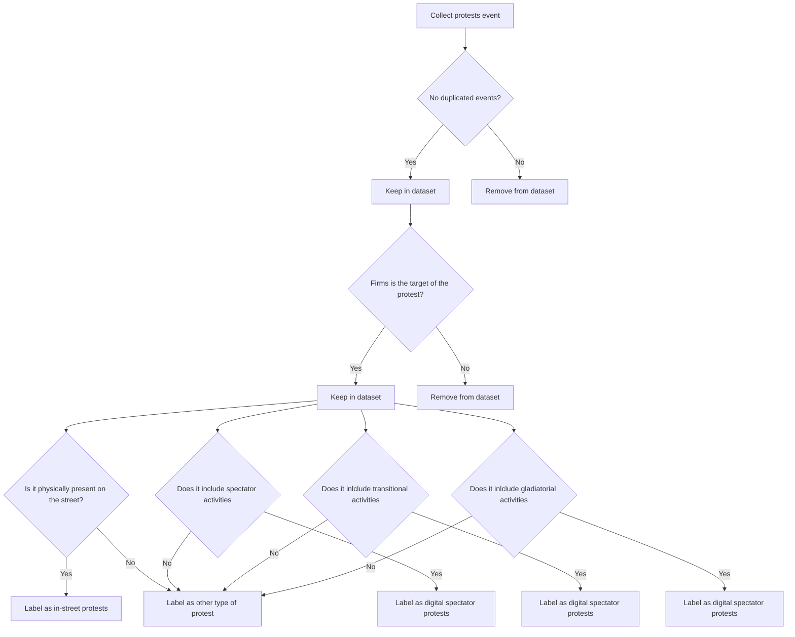

Digital and In-street Activism Events

# Goal of this project

## Identify the protest events against public firms in the United States covered by major online and traditional media from 2008 to 2019

## Classify these events into in-street, digital spectator, digital transitional, and digital gladiatorial activities

    Digital activism is a tactic that is defined as activists using digital technologies to present their requests, whereas, in-street activism is a tactic that is defined as activists physically present on the street. 
    
    George and Leidner (2019) have classified digital activism into three types based on their degree of impact:
    
    ## Digital spectator activities
    
    Clicktivism, Metavoicing, Assertion
    
    ## Digital transitional activities
    
    Political consumerism
    Digital petitions
    Botivism
    E-funding
    
    
    ## Digital gladiatorial activities
    
    Data activism
    Exposure
    Hacktivism

    One event can be classified into several categories

## Document the article source and text for check

The flow chat is as follows

# Collect protest events

Collect all the news articles with Public firms and protest-related keywords against public firms from LexisNexis, Proquest, GDELT Project, RavenPack and Factiva

Time period between 2008 and 2019

Different websites have different API and keyword searching, so the code for this part is skipped. 

# Collect protest events

BERT_model.py classify the article text based on the criteria from B to F. 
The training set for F1-F4 is stored in training datasets folder. 

# Citations
George, Jordana J., and Dorothy E. Leidner. "From clicktivism to hacktivism: Understanding digital activism." Information and organization 29.3 (2019): 100249

